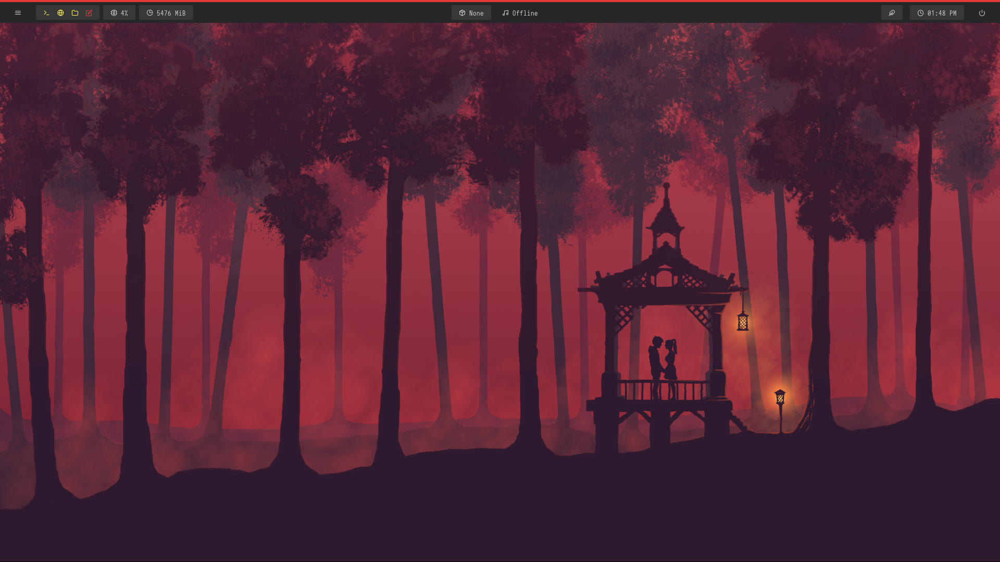

# Let's make your desktop look cool af!

## Setting up:
- First, fork this Git repository.
Install i3 window manager by running the following command depending on your distribution:
   - For Ubuntu or Debian: `sudo apt install i3`
   - For Fedora: `sudo dnf install i3`
   - For Arch Linux: `sudo pacman -S i3`

Log out and log in to i3 by selecting i3 from your display manager.
Select the super key as your mod key when prompted

Press `super key + Enter` to enter the terminal

- Install rofi by running the following command depending on your distribution:
   - For Ubuntu or Debian: `sudo apt install rofi`
   - For Fedora: `sudo dnf install rofi`
   - For Arch Linux: `sudo pacman -S rofi`

## Theming

Clone the Rofi themes themes Git repository and run its setup script by executing the following commands:

- `git clone --depth=1 https://github.com/adi1090x/rofi.git`
- `cd rofi`
- `chmod +x setup.sh`
- `./setup.sh`

    - Install Polybar by running the following command depending on your distribution:
    - For Ubuntu or Debian: `sudo apt install polybar`
    - For Fedora: `sudo dnf install polybar`
    - For Arch Linux: `sudo pacman -S polybar`
  
- Install Polybar themes from it's Git repository by running its setup script- executing the following commands:

    - `git clone --depth=1 https://github.com/adi1090x/polybar-themes.git`
    - `cd polybar-themes`
    - `chmod +x setup.sh`
    - `./setup.sh`

Copy the Polybar files from this repository to your Polybar configuration directory (`~/.config/polybar/`) by executing the following command in the installed directory:

    cp polybar/* ~/.config/polybar/

Launch Polybar with the "grayblocks" theme by running the following command:

    bash ~/.config/polybar/launch.sh --grayblocks

Copy the Rofi files from this repository to your Rofi configuration directory (`~/.config/rofi`) by executing the following command in the installed directory:

    cp rofi/* ~/.config/rofi/

Copy the i3 configuration file from this repository to your i3 configuration directory (`~/.config/i3/config`) by executing the following command in the installed directory:

    cp i3/config ~/.config/i3/

- Install Lxappearance by running the following command depending on your distribution:
    - For Ubuntu or Debian: `sudo apt install lxappearance`
    - For Fedora: `sudo dnf install lxappearance`
    - For Arch Linux: `sudo pacman -S lxappearance`
  
- Copy the cursor file from this repository to the system cursor directory (`/usr/share/icons`) by executing the following command in the installed directory:

        sudo cp cursor/* /usr/share/icons/

  - Open lxappearance and change the cursor.

- Set global font to Comforta font.

- Install nitrogen and set the wallpaper by running the following command depending on your distribution:
    - For Ubuntu or Debian: `sudo apt install nitrogen`
    - For Fedora: `sudo dnf install nitrogen`
    - For Arch Linux: `sudo pacman -S nitrogen`

- Download Greenclip clipboard manger to make your life easier. Run the following commands in your terminal:

  - `wget https://github.com/erebe/greenclip/releases/download/v4.2/greenclip`
  - `chmod +x greenclip`
  - `sudo mv greenclip /usr/local/bin`
  - `echo $PATH | grep -q /usr/local/bin && echo "greenclip is in your path" || echo "greenclip is not - in your path"`
  - `greenclip daemon`

Install Dunst notification daemon by running the appropriate command for your Linux distribution:
   - For Ubuntu or Debian: `sudo apt install dunst`
   - For Fedora: `sudo dnf install dunst`
   - For Arch Linux: `sudo pacman -S dunst`

- Create the configuration file for Dunst by running the following commands in your terminal:

- `mkdir -p ~/.config/dunst`
- `touch ~/.config/dunst/dunstrc`

- Paste the following content into the dunstrc file:

        font = DejaVu Sans Mono:size=10

        command = dunstify

        monitor = 0

        geometry = "500x1-1+40"

        shrink = no

        transparency = yes

        background = "#282c34"

        foreground = "#e5c07b"

        format = "%s"

Launch Dunst by running the following command in your terminal:

    dunst &

## Reboot your system

That's it! You should now have a fully functional i3 setup with Rofi, Polybar, and Dunst running smoothly.